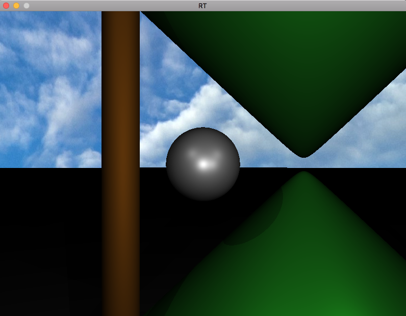
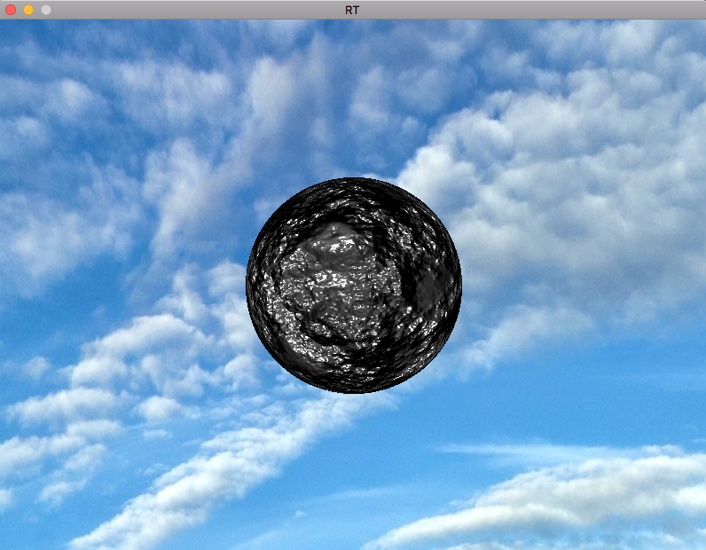

# Ray Tracer


<br />
<br />
<br />


This [Ray Tracer](https://en.wikipedia.org/wiki/Ray_tracing_(graphics)) was created as a school project

Ray tracing is a rendering technique using 3d vectors to reproduce the reality effect of lights on shapes such as Sphere, Cylinder, Cones and Planes

We added the torus and triangle as complex shapes.

This program used OpenCL for parallel programming to accelerate the movement and the rendering speed

Project created on pure C with SDL (SDL2 & SDL2_image), GTK+3 & OpenCL

### Prerequisites

Please once install GTK+3, SDL2 and SDL2_image.

Send me a notification if you find compatibility issues

## Installing

Clone with :

```
git clone https://github.com/kmjaku/Ray-Tracer.git ~/RT
cd ~/RT
make
```

Launch RT like :

```
./rt
```

Now, a window named RT is running :

```
click [Open]
then select the folder you've cloned [~/RT]
then select the folder which contain the scene [Scene]
and chose the scene you want to run [example.rt]
```

Modify and play around with the scene files available in the Scene folder, you can even make your own !

Send me a notification if you find compatibility issues

### Clean

Clean your directory using the available commands

Delete object files

```
make clean
```

Delete binaries and libraries

```
make fclean
```

## Keyboard Shortcuts

The shortcut are essential to navigate in the scene and move objects

### Camera Controls

- <kbd>w</kbd> / <kbd>s</kbd> camera move up / down
- <kbd>a</kbd> / <kbd>d</kbd> camera move left / right
- <kbd>&uarr;</kbd> / <kbd>&darr;</kbd> camera move forward / backward
- <kbd>4</kbd> / <kbd>6</kbd> camera looking left / right
- <kbd>8</kbd> / <kbd>2</kbd> camera looking up / down

## Frameworks used

* [SDL](https://www.libsdl.org/) - The graphic library
* [OpenCL](https://www.khronos.org/opencl/) - API for parallel programming
* [GTK](https://www.gtk.org) - is a cross-platform widget toolkit for creating graphical user interfaces.

## Contact & Copyright

Project done with Brahim EL BAZ, Ibrahima TRAORE & Thibaut CHIN
If you want to contact me, you can send me a mail at kmjaku@student.42.fr

### Acknowledgments

* My thanks to the [42](http://www.42.fr/) school where we worked countless hours to finish this project
